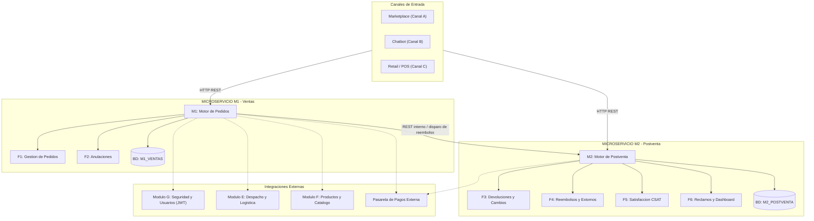

# Módulo D: Ventas y Postventa (G5-Ventas-Postventas)

Bienvenido al repositorio oficial de diseño y especificaciones del **Módulo D — Ventas y Postventa** de una plataforma de comercio electrónico especializada en **productos deportivos**. Este módulo agrupa el núcleo transaccional de compras y el ciclo integral post-compra del sistema, y es una pieza más de un proyecto mayor (módulos A/B/C — canales de venta, D — este módulo, E — Despacho y Logística, F — Productos y Ofertas, G — Seguridad y Usuarios).

---

## Tabla de contenidos

1. [Visión general y propósito](#visión-general-y-propósito)
2. [Arquitectura de microservicios](#arquitectura-de-microservicios)
3. [Matriz de funcionalidades y responsables](#matriz-de-funcionalidades-y-responsables)
4. [Stack tecnológico](#stack-tecnológico)
5. [Estructura del repositorio](#estructura-del-repositorio)
6. [Requerimientos no funcionales clave](#requerimientos-no-funcionales-clave)
7. [Estado del proyecto](#estado-del-proyecto)
8. [Guía UX/UI](#guía-uxui)
9. [Documentación de referencia](#documentación-de-referencia)
10. [Prototipo en Figma](#prototipo-en-figma)

---

## Visión general y propósito

El **Módulo D** cubre de extremo a extremo las siguientes operaciones:

1. **Captura y gestión del ciclo de vida de pedidos (F1):** recepción y control de estados de órdenes provenientes de los canales de entrada — Marketplace (A), Chatbot (B) y Retail/POS (C).
2. **Gestión de anulaciones tempranas (F2):** cancelación directa ante fallos de pago, o anulación condicionada a aprobación de un Gestor cuando el pedido ya está en preparación.
3. **Atención de postventa (F3):** carga de evidencias, dictamen técnico y gestión de devoluciones/cambios de producto post-entrega.
4. **Orquestación de reembolsos financieros (F4):** reversión monetaria hacia la pasarela de pagos externa, garantizando idempotencia estricta (`X-Idempotency-Key`).
5. **Medición de experiencia CSAT (F5):** recolección de calificaciones (1 a 5) y comentarios post-entrega.
6. **Cumplimiento normativo y analítica (F6):** Libro de Reclamaciones digital con código de seguimiento único, SLA de 15 días hábiles (Indecopi), y dashboard ejecutivo.

---

## Arquitectura de microservicios

El módulo está desacoplado en dos microservicios independientes bajo el patrón **Database-per-Service** (ver [specs/overview.md](specs/overview.md)):



### Principios de aislamiento (RNF-07)

- `M1_VENTAS` y `M2_POSTVENTA` no comparten tablas, esquemas ni llaves foráneas físicas.
- M2 referencia al `idPedido` de M1 exclusivamente por API REST, nunca por consulta directa a la base de datos.
- Ningún módulo externo (A, B, C, E, F, G) accede directamente a estas bases de datos: toda comunicación pasa por API REST o eventos de dominio.
- Cada cambio de estado de un pedido se audita cronológicamente en `HISTORIAL_ESTADO` con timestamp UTC y actor identificable.

---

## Matriz de funcionalidades y responsables

| Código | Funcionalidad | Servicio | Responsable | Rama | Descripción |
|:---:|---|:---:|:---:|:---:|---|
| **F1** | Gestión de Pedidos | M1 | Michael | `Michael` | Máquina de estados del pedido (`CREADO` → `ENTREGADO`), snapshot inmutable de cliente y precios. |
| **F2** | Anulación de Pedidos | M1 | Luis Arroyo | `Luis-Arroyo` | Cancelación directa en estados tempranos, o con aprobación de Gestor en `EN_PREPARACION`. |
| **F3** | Devoluciones y Cambios | M2 | Joseph | `Joseph` | Carga de evidencias, registro de solicitudes y dictamen técnico post-entrega. |
| **F4** | Reembolsos y Extornos | M2 | Luis Alejandro | `Luis-Alejandro` | Orquestación de extornos a pasarela con validación idempotente obligatoria. |
| **F5** | Satisfacción (CSAT) | M2 | Johan | `Johan` | Recolección de calificaciones (1 a 5) y comentarios post-entrega. |
| **F6** | Libro de Reclamaciones y Dashboard | M2 | Fabrizio | `Fabrizio` | Registro de quejas (SLA 15 días hábiles, Indecopi), respuesta pública y métricas ejecutivas. |

Antes de contribuir, revisa [CONTRIBUTING.md](CONTRIBUTING.md) para el flujo de ramas y convenciones de commit.

---

## Stack tecnológico

### Frontend (Portal del Gestor / Backoffice)

- **Librería base:** React (v18+)
- **Lenguaje:** TypeScript
- **Herramienta de compilación:** Vite
- **UI Kit:** Mantine UI
- **Diseño visual:** Figma (wireframes W01–W08)
- **Cliente HTTP:** Fetch/Axios con interceptores para JWT (`Authorization: Bearer <token>`)

Detalle completo en [specs/stack-frontend.md](specs/stack-frontend.md).

### Backend y APIs

- **Estándar de API:** REST / OpenAPI, documentado en [specs/api-contract.md](specs/api-contract.md)
- **Formato de transmisión:** `application/json; charset=utf-8` (y `multipart/form-data` en F3, para evidencias)
- **Seguridad:** tokens JWT emitidos por el Módulo G
- **Formato de fechas:** ISO-8601 UTC (`YYYY-MM-DDTHH:mm:ssZ`)

---

## Estructura del repositorio

```
G5-Ventas-Postventas/
├── README.md                      # Este archivo
├── CONTRIBUTING.md                # Guía de contribución, flujo de ramas y normas
├── AGENTS.md                      # Contexto de negocio para asistentes de IA
├── .gitignore
│
├── specs/
│   ├── overview.md                # Visión general del módulo D
│   ├── api-contract.md            # Contrato de API (OpenAPI/REST)
│   ├── stack-frontend.md          # Definición tecnológica del frontend
│   ├── glosario.md                # Lenguaje ubicuo del dominio
│   ├── modelo-datos.md            # Diccionario de datos
│   │
│   ├── funcionalidades/           # Visión general por funcionalidad (F1 a F6)
│   │   ├── F1-Ciclo de vida del pedido.md
│   │   ├── F2-Anulacion de pedidos.md
│   │   ├── F3-Devoluciones y cambios.md
│   │   ├── F4-Reembolsos y extornos.md
│   │   ├── F5-Calificacion de experiencia.md
│   │   └── F6-Reclamo,dashboard y reportes.md
│   │
│   └── especificaciones/
│       ├── funcionales/           # ESP-01 a ESP-16 (criterios de aceptación por RF)
│       └── no-funcionales/        # RNF-01 a RNF-08 (performance, seguridad, idempotencia...)
│
└── diseno/
    ├── diagramas/
    │   └── diagrama-er.md         # Modelo entidad-relación (M1 y M2)
    └── wireframes/
        ├── 00-Contexto-Wireframes.md
        ├── W01-Dashboard.md
        ├── W02-Bandeja de pedidos.md
        ├── W03-Detalle del pedido.md
        ├── W04-Anulaciones.md
        ├── W05-Devoluciones y cambios.md
        ├── W06-Reclamos.md
        ├── W07-Reembolsos.md
        └── W08-Calificaciones y reportes.md
```

---

## Requerimientos no funcionales clave

| RNF | Nombre | Resumen |
|---|---|---|
| RNF-01 | Performance | Operaciones transaccionales de pedido < 500 ms (p95); dashboard < 2 s (p95) con ≥ 5 000 pedidos. |
| RNF-02 | Seguridad | Validación JWT, RBAC por rol, pruebas de `401`/`403`. |
| RNF-03 | Trazabilidad | Historial inmutable de estados y movimientos de dinero, con actor y fecha. |
| RNF-04 | Usabilidad | Consola responsive, feedback claro, confirmación de acciones irreversibles. |
| RNF-05 | Disponibilidad | Checkout desacoplado, sin llamadas bloqueantes a servicios periféricos. |
| RNF-06 | Mantenibilidad | OpenAPI versionado, migraciones de BD gestionadas. |
| RNF-07 | Aislamiento | Sin esquemas compartidos ni JOIN cruzados entre `M1_VENTAS` y `M2_POSTVENTA`. |
| RNF-08 | Idempotencia | `X-Idempotency-Key` obligatorio en solicitudes de reembolso. |

Detalle completo de cada uno en [`specs/especificaciones/no-funcionales/`](specs/especificaciones/no-funcionales/).

---

## Estado del proyecto

**Hito 1 (completado):** especificaciones funcionales (ESP-01 a ESP-16) y no funcionales (RNF-01 a RNF-08) de F1 a F6, wireframes de consola (W01–W08), diagrama entidad-relación y contrato de API.

**Pendiente:** implementación de código (frontend y backend). Todavía no existe un proyecto inicializado (`package.json`, carpeta `src/`, etc.) — la guía de instalación y ejecución local se agregará a este README en cuanto arranque esa etapa.

---

## Guía UX/UI

- [Guía UX/UI de la plataforma](https://docs.google.com/document/d/1G0LNrLTyebiCu84i5fzmHE8zAQHfhycqQyE39PsMnpI/edit?usp=sharing)

## Prototipo en Figma

- [Mockup Avance](https://www.figma.com/design/J2KeLP6nl8qlDunNNUAC52/Mockup-Ovejita?node-id=0-1&t=PekgkEgirKTfGdiP-1)

## Documentación de referencia

- [Visión general de arquitectura](specs/overview.md)
- [Contrato de API REST](specs/api-contract.md)
- [Stack de frontend](specs/stack-frontend.md)
- [Glosario del dominio](specs/glosario.md)
- [Diagrama entidad-relación](diseno/diagramas/diagrama-er.md)
- [Prototipo anterior en Figma](https://www.figma.com/design/6GzOHE5mfItYRTMFtHIPiU/Untitled?node-id=129-787&t=1TBNyETO4gqAVJM3-1)