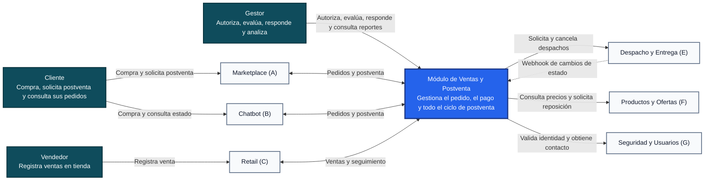

# Arquitectura C4: Diagrama de Contexto

> **Estado:** Propuesta para discusión del equipo. Este documento no modifica ni reemplaza las especificaciones funcionales vigentes.

Este documento presenta el nivel 1 del modelo C4 del Módulo de Ventas y Postventa. Su objetivo es mostrar, sin detalles técnicos de implementación, quiénes utilizan el sistema, con qué sistemas externos se integra y qué información intercambia con cada uno. Los mecanismos de comunicación se alinean con `specs/api-contract.md`.

## 1. Diagrama de contexto

## 2. Personas y responsabilidades

| Persona | Qué entrega al sistema | Qué recibe del sistema |
|---|---|---|
| Cliente | Pedido, motivo de anulación o devolución, evidencia, calificación y reclamo, siempre a través de un canal | Confirmación y estado del pedido, resultado de su solicitud de postventa, encuesta y respuesta al reclamo |
| Vendedor | Registro de la venta en tienda mediante Retail | Confirmación de la venta y seguimiento del pedido |
| Gestor | Autorización de anulaciones, evaluación de devoluciones y respuesta a reclamos | Bandejas de trabajo, historial del pedido, indicadores y reportes |

## 3. Sistemas externos e intercambios

| Sistema externo | Información recibida por Ventas y Postventa | Información enviada por Ventas y Postventa | Mecanismo | Funcionalidad relacionada |
|---|---|---|---|---|
| Marketplace (A) | Creación de pedido y solicitudes de postventa | Confirmación, estado e historial del pedido; resultado de la postventa | API REST síncrona | F1 a F6 |
| Chatbot (B) | Creación de pedido, consulta de estado y solicitudes de postventa | Confirmación y estado del pedido; resultado de la postventa | API REST síncrona | F1 a F6 |
| Retail (C) | Registro de venta y consulta de seguimiento | Confirmación de venta y estado del pedido | API REST síncrona | F1 |
| Despacho y Entrega (E) | Cambios de estado del despacho, con identificador idempotente | Solicitud de despacho de un pedido pagado y preparado; solicitud de cancelación | API REST síncrona de salida y webhook HTTPS con reintentos de entrada | F1, F2 |
| Productos y Ofertas (F) | Precio y disponibilidad vigentes por ítem | Consulta al crear el pedido; solicitud de reposición de stock al anular | API REST síncrona | F1, F2 |
| Seguridad y Usuarios (G) | JWT, roles, claves públicas y datos de contacto del cliente | Validación de tokens | Validación local de JWT mediante JWKS y API REST | Todas, especialmente F5 y F6 |

## 4. Límites del contexto

- El sistema es dueño del pedido, el pago declarado, las anulaciones, las devoluciones, los reembolsos, las calificaciones y los reclamos.
- Despacho y Entrega conserva la propiedad del despacho, los repartidores, las rutas y las zonas.
- Productos y Ofertas conserva la propiedad del catálogo y el stock.
- Seguridad y Usuarios conserva la propiedad de las identidades, credenciales y roles.
- Marketplace, Chatbot y Retail son canales consumidores; no acceden a la consola del Gestor ni a los datos del módulo.
- No se integra una pasarela de pago real; se utiliza un simulador para efectos del curso.

## 5. Acuerdos externos pendientes

Antes de aprobar este contexto se debe confirmar con los otros equipos:

1. Con Despacho y Entrega, la URL y el scope que expondremos para recibir su webhook, y qué ocurre con un pedido cuyo paquete queda `DEVUELTO_A_ORIGEN`.
2. Con Marketplace y Chatbot, si las solicitudes de postventa llegarán siempre a través de ellos.
3. Con Productos y Ofertas, la ruta y el formato de la consulta de precio y disponibilidad.
4. Con Seguridad y Usuarios, el emisor y los scopes del JWT, y los datos de contacto que expone.

## 6. Regla de lectura

Este diagrama responde únicamente a las preguntas **quién usa el sistema** y **con qué otros sistemas se comunica**. Vercel, Render, Supabase, la consola del Gestor, el API Gateway y los microservicios pertenecen al nivel de contenedores y se muestran en `c4-nivel-2-contenedores-ventas-postventa.md`.
