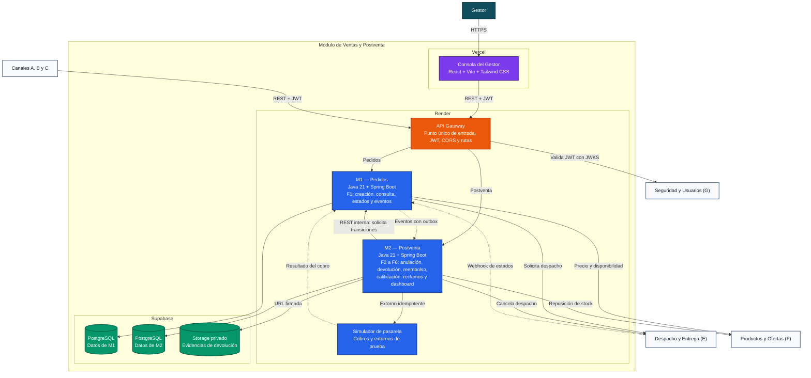

# Arquitectura C4: Diagrama de Contenedores

> **Estado:** Propuesta para discusión del equipo. Ningún contenedor, protocolo o proveedor descrito aquí se considera aprobado hasta que el equipo lo acuerde.

Este documento presenta el nivel 2 del modelo C4. Muestra una arquitectura con una aplicación frontend, un API Gateway, dos microservicios, persistencia administrada, un simulador de pasarela de pago y notificación asíncrona mediante bandeja de salida.

## 1. Diagrama de contenedores



## 2. Catálogo de contenedores

| Contenedor | Responsabilidad | Tecnología prevista | Despliegue | Dependencias directas |
|---|---|---|---|---|
| Consola del Gestor | Bandejas de pedidos, anulaciones, devoluciones y reclamos; dashboard | React, Vite y Tailwind CSS | Proyecto en Vercel | API Gateway |
| API Gateway | Única URL pública; enrutamiento, CORS, validación de JWT y correlación | Java con componente Gateway compatible con Spring | Servicio en Render | Seguridad y Usuarios, M1, M2 |
| M1 — Pedidos | Fuente única del estado del pedido: creación, consulta, máquina de estados, historial y eventos | Java 21, Spring Boot, Spring Web, Spring Security y JPA | Servicio en Render | Su PostgreSQL, Productos y Ofertas, Despacho y Entrega |
| M2 — Postventa | Anulación, devolución y cambio, reembolso, calificación, reclamos y dashboard | Java 21, Spring Boot, Spring Web, Spring Security y JPA | Servicio en Render | Su PostgreSQL, Storage, M1, Simulador, Productos y Ofertas, Despacho y Entrega |
| Simulador de pasarela | Confirma o rechaza cobros y procesa extornos con respuestas configurables | Spring Boot mínimo | Servicio en Render | M1, M2 |
| Datos de M1 | Pedidos, ítems, historial de estados y bandeja de salida | PostgreSQL administrado por Supabase | Esquema aislado | Solo M1 |
| Datos de M2 | Anulaciones, devoluciones, reembolsos, encuestas, reclamos y tablas del dashboard | PostgreSQL administrado por Supabase | Esquema aislado | Solo M2 |
| Evidencias | Fotografías de devoluciones | Supabase Storage privado | Bucket privado | Solo M2 emite URLs firmadas |

## 3. Responsabilidad de cada microservicio

### 3.1. M1 — Pedidos

Este microservicio responde **en qué estado está el pedido y qué transiciones son válidas**.

- ESP-01: creación del pedido con sus bloques `canal`, `items`, `cupon`, `envio`, `contacto` y `pago`.
- ESP-02: consulta por identificador y listado por cliente.
- ESP-03: máquina de estados, matriz de transiciones e historial.
- ESP-04: publicación de `pedido.pagado`, `pedido.anulado` y `pedido.entregado`.

### 3.2. M2 — Postventa

Este microservicio responde **qué ocurre con el pedido después de pagado o entregado**.

- F2: anulación con motivo y autorización del Gestor cuando corresponde.
- F3: devolución o cambio con evidencia y resolución.
- F4: reembolso idempotente contra el simulador de pasarela.
- F5: encuesta de calificación al recibir `pedido.entregado`.
- F6: reclamos con plazo de atención, dashboard y reportes.

Cuando F2 necesita anular un pedido, M2 solicita la transición a M1. Solo M1 modifica el estado canónico y el historial del pedido.

## 4. Comunicaciones

La arquitectura utiliza REST para preguntas y comandos que necesitan una respuesta inmediata, y bandeja de salida para comunicar hechos ya confirmados.

| Interacción | Mecanismo | Motivo |
|---|---|---|
| Canal crea o consulta un pedido | API REST síncrona mediante el Gateway | El canal necesita mostrar una respuesta inmediata al cliente. |
| M2 solicita una transición a M1 | API REST interna síncrona e idempotente | M2 necesita saber si la transición fue aceptada antes de continuar. |
| M1 comunica eventos a M2 | Bandeja de salida con identificador idempotente y reintentos | F5 y F6 reaccionan sin que M1 dependa de la disponibilidad de M2. |
| Simulador informa el resultado del cobro | HTTP interno idempotente hacia M1 | Dispara `CREADO → PAGADO` o `CREADO → ANULADO`. |
| M2 solicita un extorno | API REST síncrona con clave idempotente | Un reintento nunca debe duplicar el reembolso. |
| M1 solicita un despacho | API REST síncrona e idempotente | Despacho valida cobertura y devuelve identificador y código de rastreo. |
| M2 solicita cancelar un despacho | API REST síncrona e idempotente | F2 necesita saber si el despacho todavía se puede cancelar. |
| Despacho informa cambios de estado | Webhook HTTPS con outbox, identificador idempotente y reintentos | Contrato ya propuesto por Despacho y Entrega. |
| Seguridad entrega identidad y roles | JWT validado localmente mediante JWKS | Evita consultar Seguridad en cada petición. |

### 4.1. Eventos y bandeja de salida

No se incorpora un broker de mensajería. M1 registra cada evento en su bandeja de salida dentro de la misma transacción del cambio de estado. Un proceso posterior lo entrega a M2 y reintenta conservando el mismo identificador; M2 descarta los identificadores ya procesados.

## 5. Propiedad y aislamiento de datos propuestos

- Cada microservicio utiliza una credencial de base de datos diferente.
- Un microservicio no consulta tablas ni esquemas del otro y no existen claves foráneas cruzadas.
- Para el curso se puede utilizar un único proyecto de Supabase con dos esquemas aislados.
- M2 conserva solo el identificador del pedido, no relaciones JPA hacia las tablas de M1.
- Supabase Auth no se utiliza: la autenticación y los roles pertenecen al módulo Seguridad y Usuarios.
- El Gateway valida la firma y vigencia del token como primera barrera; cada microservicio vuelve a validar el rol, la operación permitida y la propiedad del recurso.
- Las llamadas internas entre microservicios utilizan credenciales de servicio y no quedan expuestas como rutas públicas del Gateway.

## 6. Flujo candidato de evidencia fotográfica

1. El canal solicita al Gateway autorización para cargar la evidencia de una devolución.
2. M2 valida el JWT, la propiedad del pedido y que la devolución esté `SOLICITADA`.
3. M2 genera una autorización temporal de carga para el bucket privado.
4. El archivo se carga directamente en Supabase Storage.
5. El canal confirma enviando la referencia de la evidencia, no la fotografía en Base64.
6. Para visualizarla, el Gestor recibe una URL firmada de corta vigencia.

## 7. Organización de repositorios y despliegues

```text
G5-Ventas-Postventas/
└── documentación funcional, C4, contratos y decisiones

frontend/
└── consola-gestor/

backend/
├── api-gateway/
├── servicio-pedidos/
├── servicio-postventa/
├── simulador-pasarela/
└── pom.xml
```

| Repositorio | Aplicaciones | Despliegues previstos |
|---|---|---|
| `G5-Ventas-Postventas` | Documentación | Sin despliegue de ejecución |
| `frontend` | Consola del Gestor | Un proyecto en Vercel |
| `backend` | API Gateway, dos microservicios y simulador | Cuatro servicios en Render |

### 7.1. Configuración mínima por despliegue

| Despliegue | Directorio raíz sugerido | Configuración externa necesaria |
|---|---|---|
| Vercel: Consola del Gestor | `consola-gestor` | URL pública del API Gateway |
| Render: API Gateway | `api-gateway` | URL interna de ambos microservicios, origen CORS y datos para validar tokens |
| Render: M1 — Pedidos | `servicio-pedidos` | Conexión PostgreSQL propia, URL de Productos, URL de Despacho y URL interna de M2 |
| Render: M2 — Postventa | `servicio-postventa` | Conexión PostgreSQL propia, URL interna de M1, URL del simulador, URLs de Productos y Despacho, credenciales de Storage |
| Render: Simulador | `simulador-pasarela` | URL interna de M1 y modo de respuesta |

Los secretos se configuran únicamente en Render. Nunca se incorporan al código fuente ni a las variables públicas de Vercel.

## 8. Decisiones que el equipo debe cerrar

| Decisión | Recomendación para discutir | Cuándo cambiarla |
|---|---|---|
| URL y seguridad del webhook de Despacho | Ruta del Gateway hacia M1 con scope propio | Confirmar con Despacho y Entrega |
| Pedido con paquete `DEVUELTO_A_ORIGEN` | Abrir un caso de postventa para que el Gestor decida | Si el curso define otro tratamiento |
| Mensajería de eventos | Bandeja de salida sin broker | Incorporar un broker si aparecen más consumidores |
| Simulador de pasarela | Servicio propio en Render | Embebido en M2 si se limita la cantidad de servicios |
| Base de datos | Un proyecto Supabase con dos esquemas y credenciales aisladas | Separar proyectos si se necesita aislamiento físico |
| Autenticación | Consumir JWT de Seguridad; no usar Supabase Auth | Solo por acuerdo con Seguridad y Usuarios |
