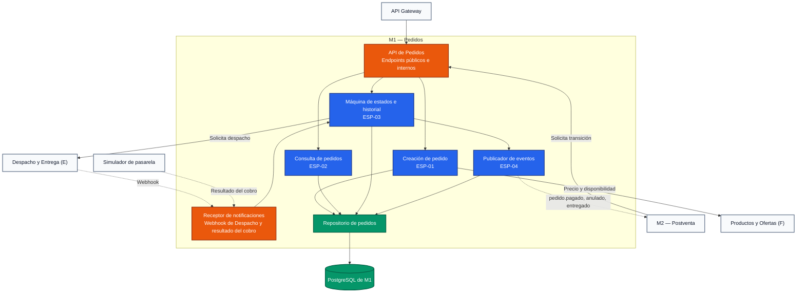
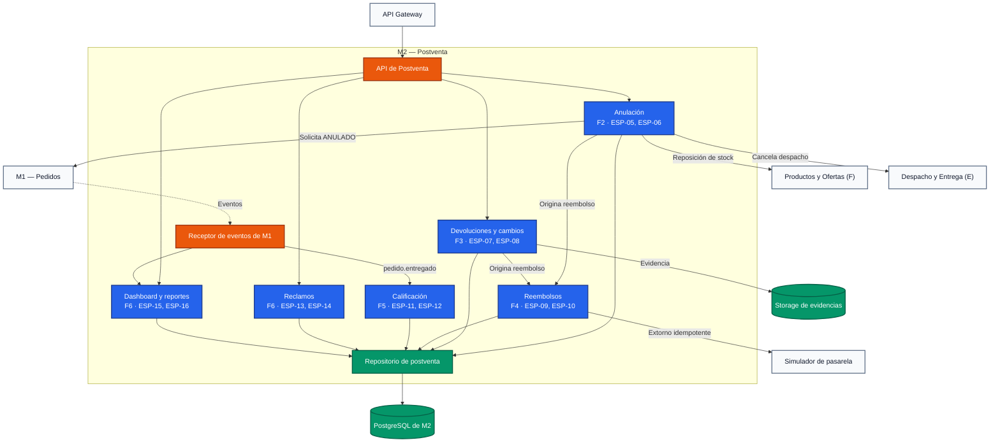

# Arquitectura C4: Diagrama de Componentes

> **Estado:** Propuesta para discusión del equipo. Este documento no modifica ni reemplaza las especificaciones funcionales vigentes.

Este documento presenta el nivel 3 del modelo C4. Muestra los componentes internos de los dos microservicios descritos en `c4-nivel-2-contenedores-ventas-postventa.md` y la especificación que implementa cada uno.

## 1. Componentes de M1 — Pedidos

| Componente | Responsabilidad | Especificación |
|---|---|---|
| API de Pedidos | Expone creación, consulta y cambio de estado; recibe las solicitudes de transición de M2 | ESP-01 a ESP-03 |
| Receptor de notificaciones | Recibe el webhook de Despacho y el resultado del cobro; descarta duplicados por identificador | ESP-03 |
| Creación de pedido | Valida los bloques `canal`, `items`, `cupon`, `envio`, `contacto` y `pago`, y registra el pedido `CREADO` | ESP-01 |
| Consulta de pedidos | Detalle por identificador y listado por cliente, con control de propiedad | ESP-02 |
| Máquina de estados e historial | Único componente que cambia el estado; valida la matriz de transiciones y registra actor, motivo y fecha | ESP-03 |
| Publicador de eventos | Registra los eventos en la bandeja de salida y los entrega a M2 con reintentos | ESP-04 |
| Repositorio de pedidos | Acceso a pedidos, historial y bandeja de salida | ESP-01 a ESP-04 |

## 2. Componentes de M2 — Postventa

| Componente | Responsabilidad | Especificación |
|---|---|---|
| API de Postventa | Expone anulaciones, devoluciones, reclamos, encuestas y reportes | ESP-05 a ESP-16 |
| Receptor de eventos de M1 | Recibe los eventos de M1 y descarta los ya procesados | ESP-11, ESP-15 |
| Anulación | Valida estado y motivo, exige Gestor en `EN PREPARACIÓN`, solicita la transición a M1 y coordina stock, despacho y reembolso | ESP-05, ESP-06 |
| Devoluciones y cambios | Registra la solicitud con evidencia y resuelve cambio, reembolso o rechazo | ESP-07, ESP-08 |
| Reembolsos | Acepta solo orígenes de F2 o F3, evita duplicados con clave idempotente y registra cada intento | ESP-09, ESP-10 |
| Calificación | Envía la encuesta al recibir `pedido.entregado` y calcula el CSAT | ESP-11, ESP-12 |
| Reclamos | Registra el reclamo con plazo legal y la respuesta formal del Gestor | ESP-13, ESP-14 |
| Dashboard y reportes | Mantiene tablas agregadas y sirve indicadores y reportes | ESP-15, ESP-16 |
| Repositorio de postventa | Acceso a los datos propios de M2 | ESP-05 a ESP-16 |

## 3. Reglas de dependencia

- Solo la máquina de estados de M1 modifica el estado del pedido; M2 solicita las transiciones por API.
- M2 no accede a las tablas de M1.
- Reembolsos solo se activa desde Anulación o Devoluciones.
- El dashboard lee tablas agregadas, nunca las tablas transaccionales.

## 4. Regla de lectura

Este diagrama responde únicamente a la pregunta **cómo se organiza cada microservicio por dentro**. Las clases, entidades y endpoints detallados pertenecen a las especificaciones funcionales y al código fuente.
