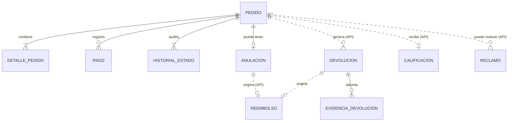

# Modelo conceptual - Ventas y Postventa

Muestra las entidades del módulo, sus atributos y cómo se relacionan. No incluye tipos de datos ni claves foráneas; eso está en el [modelo lógico](diagrama-logico.md).

Las entidades se dividen según el microservicio al que pertenecen:

- M1 Ventas: pedido, detalle, pago, historial de estados y anulación.
- M2 Postventa: devolución, evidencia, reembolso, reclamo, calificación y agregados del dashboard.

## 1. Diagrama

Archivo editable: [diagrama-conceptual.drawio](diagrama-conceptual.drawio)

Carpeta del equipo en Drive: https://drive.google.com/drive/folders/1348tkN7TzHICA0R6juXmMFJekAxfxBnx?usp=sharing

## 2. Notación

| Elemento | Significado |
|---|---|
| Atributo subrayado | Identificador |
| Atributo en gris con (G), (E) o (F) | Dato de otro módulo: Seguridad y Usuarios (G), Despacho y Entrega (E) o Productos y Ofertas (F) |
| Línea continua | Relación dentro del mismo microservicio, con clave foránea |
| Línea punteada | Relación sin clave foránea. Entre M1 y M2 se resuelve por API; el reembolso usa idOrigen + tipoOrigen |

## 3. Entidades de M1

| Entidad | Atributos | Descripción |
|---|---|---|
| PEDIDO | id, codigo, canal, fecha, estado, moneda, subtotal, descuento, total, nombreContacto, tipoDocumento, numeroDocumento, telefono, email, modalidadEnvio, costoEnvio, destinatario, distrito, direccion, codigoCupon, creadoEn, idCliente (G), idVendedor (G), idDireccionEntrega (E) | Compra con su estado, importes, contacto y datos de envío |
| DETALLE_PEDIDO | id, idProducto (F), sku, descripcion, cantidad, precioUnitario, descuento, importe | Productos del pedido |
| PAGO | id, metodo, referencia, monto, estado, fechaProceso | Intentos de pago del pedido |
| HISTORIAL_ESTADO | id, estadoAnterior, estadoNuevo, actor, motivo, fechaHora | Cambios de estado del pedido |
| ANULACION | id, motivo, idSolicitante, idAutorizador, estado, fecha | Anulación del pedido (F2) |

## 4. Entidades de M2

| Entidad | Atributos | Descripción |
|---|---|---|
| DEVOLUCION | id, tipo, motivo, estado, resolucion, idAutorizador, fundamentoRechazo, fecha | Devolución o cambio de un pedido entregado (F3) |
| EVIDENCIA_DEVOLUCION | id, url, tipo, fecha | Archivos que sustentan la devolución |
| REEMBOLSO | id, tipoOrigen, idempotencyKey, monto, moneda, idTransaccion, estado, idAutorizador, fecha | Devolución de dinero por anulación o devolución (F4) |
| RECLAMO | id, codigo, tipo, motivo, detalle, nombreConsumidor, documento, email, telefono, estado, plazoDiasHabiles, fechaLimiteRespuesta, respuestaVisibleCliente | Libro de reclamaciones (F6) |
| CALIFICACION | id, puntaje, comentario, canal, fecha | Encuesta CSAT de un pedido entregado (F5) |
| AGREGADO_VENTAS | periodo, canal, idVendedor, idProducto, unidades, monto, actualizadoEn | Totales para el dashboard (F6). Se actualiza con eventos y no se relaciona con otras entidades |

## 5. Relaciones

Dentro de cada microservicio:

| Relación | Cardinalidad | Regla |
|---|---|---|
| PEDIDO - DETALLE_PEDIDO | 1 a 1..N | El pedido se crea con al menos un producto (ESP-01) |
| PEDIDO - PAGO | 1 a 0..N | Puede tener varios intentos de pago |
| PEDIDO - HISTORIAL_ESTADO | 1 a 1..N | Al crear el pedido se registra el primer historial (ESP-01) |
| PEDIDO - ANULACION | 1 a 0..1 | Un pedido se anula como máximo una vez |
| DEVOLUCION - EVIDENCIA_DEVOLUCION | 1 a 0..N | Una devolución puede tener varias evidencias |

Sin clave foránea:

| Relación | Cardinalidad | Cómo se resuelve |
|---|---|---|
| PEDIDO - DEVOLUCION | 1 a 0..N | M2 guarda idPedido y lo valida con la API de M1 |
| PEDIDO - CALIFICACION | 1 a 0..1 | Una encuesta por pedido entregado |
| PEDIDO - RECLAMO | 0..1 a 0..N | El reclamo puede no tener pedido asociado |
| ANULACION - REEMBOLSO | 1 a 0..1 | Solo si el pedido estaba pagado; tipoOrigen = ANULACION |
| DEVOLUCION - REEMBOLSO | 1 a 0..1 | Solo si la devolución se resuelve con reembolso; tipoOrigen = DEVOLUCION |

DEVOLUCION y REEMBOLSO están en el mismo microservicio, pero no tienen clave foránea porque idOrigen puede apuntar a una anulación (M1) o a una devolución (M2).

## 6. Otros modelos

| Modelo | Archivo |
|---|---|
| Lógico | [diagrama-logico.md](diagrama-logico.md) |
| Físico | [diagrama-fisico.md](diagrama-fisico.md) |
