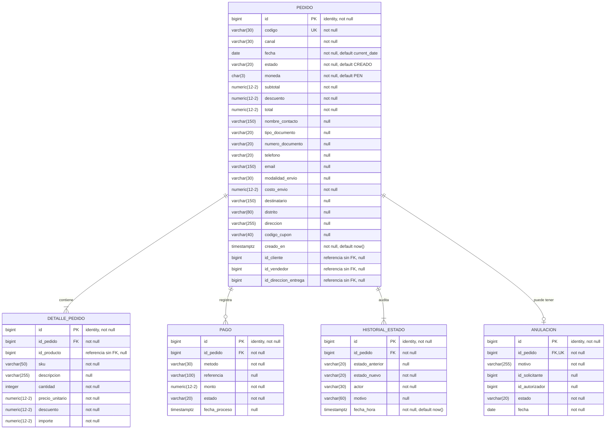
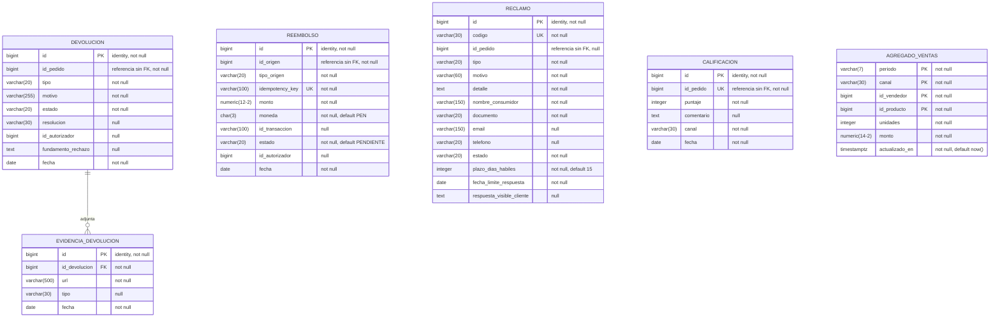

# Modelo físico - Ventas y Postventa

Implementación del [modelo lógico](diagrama-logico.md) en PostgreSQL 17 sobre Supabase (proyecto `nsfrwxrjidyckgfriyhv`). Incluye los tipos reales, valores por defecto, restricciones, índices y la configuración de seguridad. El script que crea todo es [ventas_postventa_schema.sql](../../../infra/bd/ventas_postventa_schema.sql), aplicado como la migración `crear_esquemas_ventas_postventa`.

## 1. Diagrama

Esquema ventas (M1):

Esquema postventa (M2):

Los tipos numéricos se escriben como numeric(12-2) porque Mermaid no admite comas; en la base son numeric(12,2).

Archivo editable: [diagrama-fisico.drawio](diagrama-fisico.drawio)

## 2. Esquemas

| Esquema | Microservicio | Tablas |
|---|---|---|
| ventas | M1 | pedido, detalle_pedido, pago, historial_estado, anulacion |
| postventa | M2 | devolucion, evidencia_devolucion, reembolso, reclamo, calificacion, agregado_ventas |

No hay claves foráneas entre los dos esquemas.

## 3. Tipos de datos

| Lógico | PostgreSQL | Uso |
|---|---|---|
| BIGINT (PK) | bigint generated always as identity | Identificadores; la base genera el valor |
| BIGINT | bigint | Claves foráneas y referencias a otros módulos |
| INTEGER | integer | cantidad, puntaje, unidades, plazo_dias_habiles |
| DECIMAL(12,2) | numeric(12,2) | Montos (agregado_ventas.monto usa numeric(14,2)) |
| VARCHAR(n) | varchar(n) | Códigos, estados y textos cortos |
| CHAR(3) | char(3) | moneda (código ISO, por ejemplo PEN) |
| TEXT | text | Textos largos: detalle, comentario, fundamento_rechazo, respuesta |
| DATE | date | Fechas sin hora |
| TIMESTAMP | timestamptz | Fecha y hora con zona horaria |

## 4. Valores por defecto

| Tabla | Columna | Valor |
|---|---|---|
| pedido | fecha | current_date |
| pedido | estado | 'CREADO' |
| pedido | moneda | 'PEN' |
| pedido | subtotal, descuento, total, costo_envio | 0 |
| pedido | creado_en | now() |
| detalle_pedido | descuento | 0 |
| historial_estado | fecha_hora | now() |
| anulacion, devolucion, evidencia_devolucion, calificacion, reembolso | fecha | current_date |
| reembolso | moneda | 'PEN' |
| reembolso | estado | 'PENDIENTE' |
| reclamo | plazo_dias_habiles | 15 |
| agregado_ventas | unidades, monto | 0 |
| agregado_ventas | actualizado_en | now() |

## 5. Restricciones

Claves primarias: todas las tablas usan `id`, salvo agregado_ventas, que tiene clave compuesta (periodo, canal, id_vendedor, id_producto).

Claves foráneas (todas con `ON DELETE CASCADE`):

| Tabla | Columna | Referencia |
|---|---|---|
| ventas.detalle_pedido | id_pedido | ventas.pedido(id) |
| ventas.pago | id_pedido | ventas.pedido(id) |
| ventas.historial_estado | id_pedido | ventas.pedido(id) |
| ventas.anulacion | id_pedido | ventas.pedido(id) |
| postventa.evidencia_devolucion | id_devolucion | postventa.devolucion(id) |

Valores únicos:

| Nombre | Tabla | Columnas |
|---|---|---|
| pedido_codigo_key | ventas.pedido | codigo |
| anulacion_id_pedido_key | ventas.anulacion | id_pedido |
| reclamo_codigo_key | postventa.reclamo | codigo |
| reembolso_idempotency_key_key | postventa.reembolso | idempotency_key |
| uq_reembolso_origen | postventa.reembolso | tipo_origen, id_origen |
| calificacion_id_pedido_key | postventa.calificacion | id_pedido |

CHECK:

| Nombre | Tabla | Condición |
|---|---|---|
| ck_pedido_estado | ventas.pedido | estado IN (CREADO, PAGADO, EN_PREPARACION, DESPACHADO, ENTREGADO, ANULADO) |
| ck_pedido_montos | ventas.pedido | subtotal, descuento, total y costo_envio ≥ 0 |
| ck_detalle_cantidad | ventas.detalle_pedido | cantidad > 0 |
| ck_detalle_montos | ventas.detalle_pedido | precio_unitario, descuento e importe ≥ 0 |
| ck_pago_monto | ventas.pago | monto ≥ 0 |
| ck_historial_actor | ventas.historial_estado | actor IN (CLIENTE, GESTOR, CANAL_CHATBOT, PASARELA_PAGOS, SISTEMA_LOGISTICA) |
| ck_reembolso_tipo_origen | postventa.reembolso | tipo_origen IN (ANULACION, DEVOLUCION) |
| ck_reembolso_estado | postventa.reembolso | estado IN (PENDIENTE, EXITOSO, FALLIDO) |
| ck_reembolso_monto | postventa.reembolso | monto > 0 |
| ck_reclamo_plazo | postventa.reclamo | plazo_dias_habiles > 0 |
| ck_calificacion_puntaje | postventa.calificacion | puntaje entre 1 y 5 |

## 6. Índices

Además de los que PostgreSQL crea para las claves primarias y únicas:

| Índice | Tabla | Columna |
|---|---|---|
| ix_detalle_pedido_id_pedido | ventas.detalle_pedido | id_pedido |
| ix_pago_id_pedido | ventas.pago | id_pedido |
| ix_historial_estado_id_pedido | ventas.historial_estado | id_pedido |
| ix_evidencia_id_devolucion | postventa.evidencia_devolucion | id_devolucion |
| ix_devolucion_id_pedido | postventa.devolucion | id_pedido |
| ix_reclamo_id_pedido | postventa.reclamo | id_pedido |

Los tres últimos sirven para buscar por pedido en M2 aunque esas columnas no sean claves foráneas.

## 7. Seguridad

- RLS (Row Level Security) activo en las 11 tablas, sin políticas. La API pública de Supabase no puede leer ni escribir en ellas.
- El backend se conecta directamente a PostgreSQL con su propia credencial.
- Pendiente: crear un usuario de base de datos para M1 y otro para M2, cada uno con permisos solo sobre su esquema.

## 8. Pendientes

- `ck_historial_actor` usa los valores del ER original y no coincide con ESP-03 (PASARELA, CANAL, DESPACHO, GESTOR, SISTEMA). Se corrige con una migración cuando el equipo decida qué lista usar.
- pago.estado, devolucion.estado, anulacion.estado y pedido.canal no tienen CHECK porque sus valores aún no están definidos.

## 9. Otros modelos

| Modelo | Archivo |
|---|---|
| Conceptual | [diagrama-conceptual.md](diagrama-conceptual.md) |
| Lógico | [diagrama-logico.md](diagrama-logico.md) |
