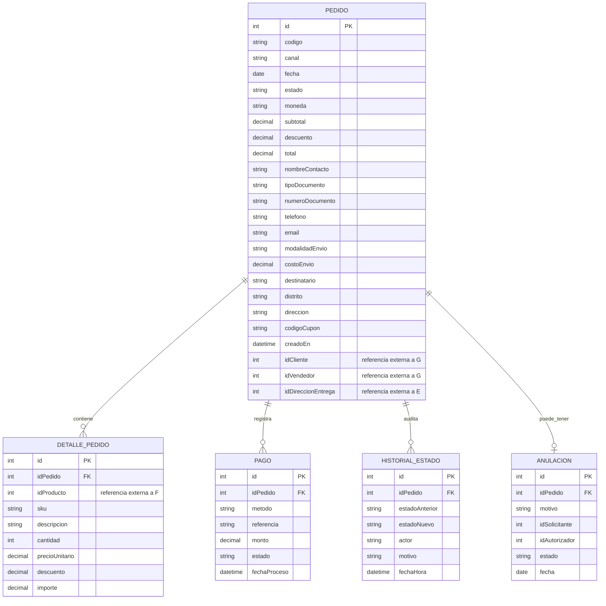
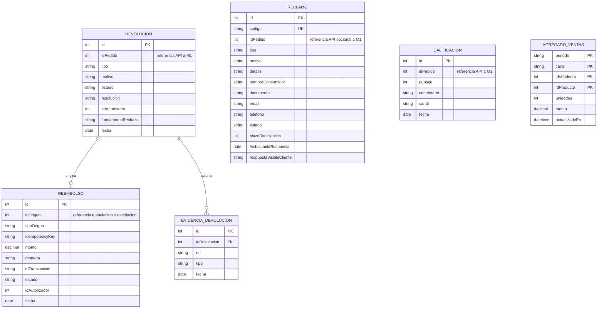

# Diagrama Entidad-Relación — Ventas y Postventa

> **Estado:** Documento de diseño. Describe el modelo de datos propuesto del Módulo D y sus límites entre microservicios.

Este documento explica el diagrama entidad-relación (ER) de Ventas y Postventa. El diseño separa la persistencia en dos esquemas independientes: **M1 — Ventas** y **M2 — Postventa**. La separación aplica el principio *Database-per-Service*: las relaciones entre datos de ambos microservicios se resuelven mediante identificadores y APIs, no mediante claves foráneas físicas.

## 1. Convenciones de lectura

| Marca | Significado |
|---|---|
| `PK` | Clave primaria de la entidad. |
| `FK` | Clave foránea física dentro del mismo microservicio. |
| `UK` | Clave única. |
| `referencia API` | Identificador lógico de una entidad que vive en otro microservicio o módulo; no crea una relación física en la base de datos local. |

Las cardinalidades se leen así: `||--o{` significa **uno a cero o muchos** y `||--o|` significa **uno a cero o uno**.

## 2. Separación entre M1 y M2

| Microservicio | Base de datos propia | Responsabilidad principal |
|---|---|---|
| **M1 — Ventas** | Pedidos, pagos, detalle, historial y anulaciones | Conserva el estado canónico del pedido y sus movimientos de venta. |
| **M2 — Postventa** | Devoluciones, evidencias, reembolsos, reclamos, calificaciones y agregados | Gestiona procesos posteriores a la compra y datos de atención al cliente. |

No existen claves foráneas entre M1 y M2. Por ejemplo, `DEVOLUCION.idPedido`, `RECLAMO.idPedido` y `CALIFICACION.idPedido` identifican un pedido de M1 mediante una referencia de API. De igual forma, un `REEMBOLSO` originado por una anulación conserva una referencia lógica a `ANULACION`, que pertenece a M1.

## 3. Modelo ER de M1 — Ventas

### 3.1. Entidad `PEDIDO`

`PEDIDO` es la entidad central de M1. Representa la compra, su estado operativo, sus importes y el *snapshot* mínimo de contacto y envío usado en la transacción.

| Grupo | Atributos | Explicación |
|---|---|---|
| Identificación | `id` (PK), `codigo`, `canal`, `fecha`, `creadoEn` | Identifica el pedido, su canal de origen y sus fechas de registro. |
| Estado e importes | `estado`, `moneda`, `subtotal`, `descuento`, `total`, `codigoCupon` | Conserva el ciclo de vida y los importes asociados a la compra. |
| Contacto | `nombreContacto`, `tipoDocumento`, `numeroDocumento`, `telefono`, `email` | Datos de contacto declarados al registrar el pedido. |
| Envío | `modalidadEnvio`, `costoEnvio`, `destinatario`, `distrito`, `direccion` | Datos necesarios para la entrega. |
| Referencias externas | `idCliente`, `idVendedor`, `idDireccionEntrega` | Referencian lógicamente a Seguridad y Usuarios (G) o Despacho y Entrega (E); no son FKs locales. |

### 3.2. Entidades dependientes de `PEDIDO`

| Entidad | Clave y atributos principales | Relación y propósito |
|---|---|---|
| `DETALLE_PEDIDO` | `id` (PK), `idPedido` (FK), `idProducto`, `sku`, `descripcion`, `cantidad`, `precioUnitario`, `descuento`, `importe` | Un pedido contiene cero o muchos detalles. `idProducto` es una referencia externa al catálogo de Productos y Ofertas (F). |
| `PAGO` | `id` (PK), `idPedido` (FK), `metodo`, `referencia`, `monto`, `estado`, `fechaProceso` | Un pedido registra cero o muchos pagos o intentos de cobro. |
| `HISTORIAL_ESTADO` | `id` (PK), `idPedido` (FK), `estadoAnterior`, `estadoNuevo`, `actor`, `motivo`, `fechaHora` | Audita los cambios de estado. `actor` puede representar, por ejemplo, al cliente, gestor, canal, pasarela o logística. |
| `ANULACION` | `id` (PK), `idPedido` (FK), `motivo`, `idSolicitante`, `idAutorizador`, `estado`, `fecha` | Un pedido puede tener como máximo una anulación; registra la solicitud, autorización y resultado de F2. |

## 4. Modelo ER de M2 — Postventa

### 4.1. Devoluciones, evidencias y reembolsos

| Entidad | Clave y atributos principales | Relación y propósito |
|---|---|---|
| `DEVOLUCION` | `id` (PK), `idPedido`, `tipo`, `motivo`, `estado`, `resolucion`, `idAutorizador`, `fundamentoRechazo`, `fecha` | Registra la solicitud postventa. `idPedido` referencia por API al pedido de M1, sin FK física. |
| `EVIDENCIA_DEVOLUCION` | `id` (PK), `idDevolucion` (FK), `url`, `tipo`, `fecha` | Una devolución puede adjuntar cero o muchas evidencias. La URL apunta al almacenamiento de evidencias. |
| `REEMBOLSO` | `id` (PK), `idOrigen`, `tipoOrigen`, `idempotencyKey`, `monto`, `moneda`, `idTransaccion`, `estado`, `idAutorizador`, `fecha` | Registra un extorno y sus datos de control. Para una devolución, la relación es física dentro de M2; para una anulación, `idOrigen` es una referencia lógica hacia M1. `tipoOrigen` solo admite `ANULACION` o `DEVOLUCION`. |

La cardinalidad `DEVOLUCION ||--o| REEMBOLSO` expresa que una devolución puede no generar reembolso o generar uno. Un reembolso vinculado a devolución pertenece a una única devolución.

### 4.2. Reclamos, calificaciones y agregados

| Entidad | Clave y atributos principales | Propósito |
|---|---|---|
| `RECLAMO` | `id` (PK), `codigo` (UK), `idPedido`, `tipo`, `motivo`, `detalle`, datos del consumidor, `estado`, `plazoDiasHabiles`, `fechaLimiteRespuesta`, `respuestaVisibleCliente` | Registra el Libro de Reclamaciones. Puede asociarse opcionalmente a un pedido de M1 mediante `idPedido` como referencia API. |
| `CALIFICACION` | `id` (PK), `idPedido`, `puntaje`, `comentario`, `canal`, `fecha` | Conserva la respuesta CSAT asociada lógicamente a un pedido entregado de M1. |
| `AGREGADO_VENTAS` | PK compuesta: `periodo`, `canal`, `idVendedor`, `idProducto`; además `unidades`, `monto`, `actualizadoEn` | Mantiene datos agregados para consultas y dashboard sin recorrer las ventas transaccionales en cada solicitud. |

## 5. Relaciones físicas y referencias lógicas

### 5.1. Relaciones físicas dentro de cada microservicio

| Origen | Destino | Cardinalidad | Descripción |
|---|---|---|---|
| `PEDIDO` | `DETALLE_PEDIDO` | 1 a 0..N | Un pedido contiene sus ítems. |
| `PEDIDO` | `PAGO` | 1 a 0..N | Un pedido registra sus operaciones de pago. |
| `PEDIDO` | `HISTORIAL_ESTADO` | 1 a 0..N | Un pedido conserva su auditoría de transiciones. |
| `PEDIDO` | `ANULACION` | 1 a 0..1 | Un pedido puede tener una anulación. |
| `DEVOLUCION` | `EVIDENCIA_DEVOLUCION` | 1 a 0..N | Una devolución puede contener varias evidencias. |
| `DEVOLUCION` | `REEMBOLSO` | 1 a 0..1 | Una devolución aprobada puede originar un reembolso. |

### 5.2. Referencias sin FK física

| Campo | Entidad de destino | Regla de aislamiento |
|---|---|---|
| `DEVOLUCION.idPedido` | `PEDIDO` de M1 | Se valida mediante API de M1; M2 no consulta ni modifica tablas de M1. |
| `RECLAMO.idPedido` | `PEDIDO` de M1 | Es opcional y se conserva como referencia lógica. |
| `CALIFICACION.idPedido` | `PEDIDO` de M1 | Se utiliza para asociar la encuesta a un pedido entregado. |
| `REEMBOLSO.idOrigen` con `tipoOrigen = ANULACION` | `ANULACION` de M1 | No existe FK interservicio; F4 recibe y valida el origen por el límite de integración aprobado. |
| `PEDIDO.idCliente` / `idVendedor` | Módulo G | Son referencias externas a identidad y usuarios. |
| `PEDIDO.idDireccionEntrega` | Módulo E | Es una referencia externa a datos de entrega. |
| `DETALLE_PEDIDO.idProducto` | Módulo F | Es una referencia externa al producto o catálogo. |

## 6. Reglas de diseño representadas

- Cada microservicio es dueño exclusivo de sus tablas y persistencia.
- No se usan claves foráneas ni consultas directas entre las bases de datos de M1 y M2.
- `HISTORIAL_ESTADO` permite reconstruir el ciclo de vida del pedido sin alterar registros anteriores.
- `REEMBOLSO.idempotencyKey` permite identificar reintentos de una misma operación financiera y evitar duplicados.
- `AGREGADO_VENTAS` es una estructura de lectura agregada: optimiza el dashboard y no sustituye los registros transaccionales.
- Las referencias hacia módulos G, E y F también son lógicas, porque esos módulos son dueños de sus propios datos.

## 7. Límites del documento

El diagrama explica entidades, atributos y relaciones de persistencia. No define endpoints, payloads, tecnologías concretas, migraciones ni reglas de interfaz; dichos detalles pertenecen a las especificaciones y contratos correspondientes.
