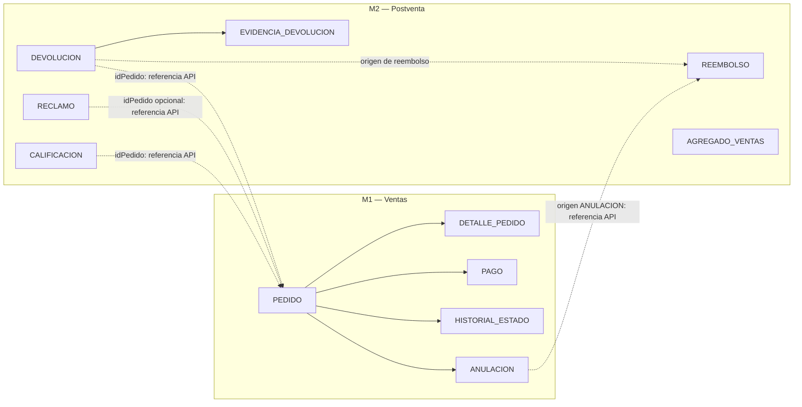
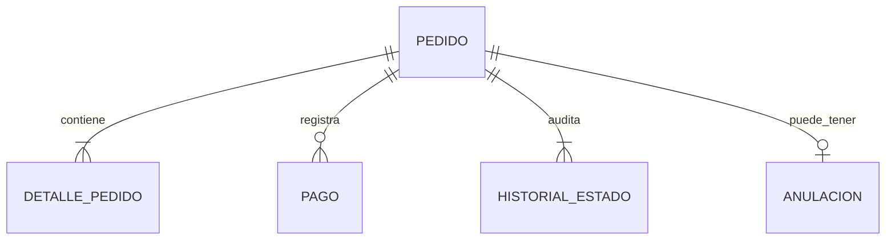
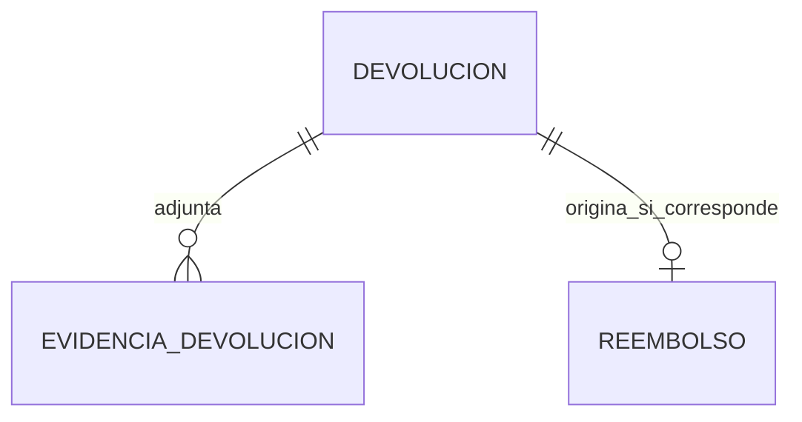

# Modelo lógico de datos — Módulo D: Ventas y Postventa

> **Estado:** Diseño lógico alineado con el modelo entidad-relación y el esquema PostgreSQL del módulo.

## 1. Propósito y alcance

Este documento transforma el modelo conceptual del negocio en un modelo lógico: define las entidades, sus identificadores, las relaciones, las reglas de integridad y los límites de propiedad de los datos.

El módulo se divide en dos microservicios bajo el patrón **Database-per-Service**:

- **M1 — Ventas:** pedidos, sus detalles, pagos, historial de estados y anulaciones.
- **M2 — Postventa:** devoluciones, evidencias, reembolsos, reclamos, calificaciones y agregados para analítica.

El modelo lógico no reemplaza el script físico de PostgreSQL. Los nombres de tablas, tipos concretos, índices y restricciones de implementación se encuentran en [`infra/ventas_postventa_schema.sql`](../../infra/ventas_postventa_schema.sql).

## 2. Convenciones

| Marca | Significado |
|---|---|
| `PK` | Identificador único de una entidad. |
| `FK` | Relación física permitida dentro del mismo microservicio. |
| `UK` | Regla de unicidad del negocio. |
| `Referencia API` | Identificador lógico de una entidad que pertenece a otro microservicio o módulo; no crea una FK física. |
| `0..1`, `0..N`, `1` | Cardinalidad mínima y máxima de la relación. |

Las fechas y eventos de auditoría se registran en UTC en la implementación. Los identificadores externos a los módulos G, E y F también se conservan como referencias lógicas.

## 3. Vista de integración y límites de datos

Las líneas punteadas representan integración por API o eventos. No son relaciones físicas entre bases de datos ni autorizan consultas directas entre M1 y M2.

## 4. Modelo lógico de M1 — Ventas

### 4.1. Entidades y atributos principales

| Entidad | Identificador y reglas | Atributos lógicos principales | Propósito |
|---|---|---|---|
| `PEDIDO` | `idPedido` (PK), `codigo` (UK) | canal, estado, fecha, moneda, subtotal, descuento, total, contacto y datos de entrega | Representa la compra y su estado canónico. |
| `DETALLE_PEDIDO` | `idDetallePedido` (PK), `idPedido` (FK) | idProducto externo, SKU, descripción, cantidad, precio unitario, descuento, importe | Conserva el detalle comercial de cada ítem del pedido. |
| `PAGO` | `idPago` (PK), `idPedido` (FK) | método, referencia, monto, estado, fecha de proceso | Registra intentos y resultados de pago asociados al pedido. |
| `HISTORIAL_ESTADO` | `idHistorial` (PK), `idPedido` (FK) | estado anterior, estado nuevo, actor, motivo, fecha y hora | Mantiene la auditoría cronológica de transiciones. |
| `ANULACION` | `idAnulacion` (PK), `idPedido` (FK, UK) | motivo, solicitante, autorizador, estado, fecha | Registra la única solicitud de anulación posible por pedido. |

### 4.2. Relaciones internas

| Relación | Cardinalidad | Regla lógica |
|---|---:|---|
| `PEDIDO` — `DETALLE_PEDIDO` | 1 a 1..N | Un pedido válido contiene al menos un ítem. |
| `PEDIDO` — `PAGO` | 1 a 0..N | Un pedido puede registrar varios intentos u operaciones de pago. |
| `PEDIDO` — `HISTORIAL_ESTADO` | 1 a 1..N | Todo cambio de estado queda auditado con actor y fecha. |
| `PEDIDO` — `ANULACION` | 1 a 0..1 | Un pedido solo puede tener una anulación registrada. |

### 4.3. Reglas de integridad de M1

1. `codigo` identifica de manera única un pedido.
2. El estado del pedido sigue el ciclo `CREADO → PAGADO → EN_PREPARACION → DESPACHADO → ENTREGADO`, con `ANULADO` como resultado permitido de una anulación elegible.
3. Un pedido despachado o entregado no puede anularse mediante F2; los casos posteriores se atienden mediante postventa.
4. Los importes y cantidades no pueden ser negativos; la cantidad del detalle debe ser mayor que cero.
5. `idCliente`, `idVendedor`, `idDireccionEntrega` e `idProducto` son referencias externas a los módulos G, E y F.

## 5. Modelo lógico de M2 — Postventa

### 5.1. Entidades y atributos principales

| Entidad | Identificador y reglas | Atributos lógicos principales | Propósito |
|---|---|---|---|
| `DEVOLUCION` | `idDevolucion` (PK), `idPedido` (Referencia API) | tipo, motivo, estado, resolución, autorizador, fundamento de rechazo, fecha | Gestiona solicitudes de devolución o cambio posteriores a la entrega. |
| `EVIDENCIA_DEVOLUCION` | `idEvidencia` (PK), `idDevolucion` (FK) | URL, tipo de archivo, fecha | Conserva los archivos que sustentan una solicitud. |
| `REEMBOLSO` | `idReembolso` (PK), `idempotencyKey` (UK), `tipoOrigen + idOrigen` (UK) | monto, moneda, transacción externa, estado, autorizador, fecha | Orquesta la devolución de dinero sin duplicar operaciones. |
| `RECLAMO` | `idReclamo` (PK), `codigo` (UK), `idPedido` opcional (Referencia API) | tipo, motivo, detalle, consumidor, estado, plazo SLA, fecha límite, respuesta visible | Registra y atiende reclamos o quejas. |
| `CALIFICACION` | `idCalificacion` (PK), `idPedido` (Referencia API, UK) | puntaje, comentario, canal, fecha | Conserva la encuesta CSAT de un pedido entregado. |
| `AGREGADO_VENTAS` | PK compuesta: periodo, canal, vendedor y producto | unidades, monto, fecha de actualización | Proyección de lectura para el dashboard y reportes. |

### 5.2. Relaciones internas y referencias lógicas

| Origen | Destino | Tipo de vínculo | Regla lógica |
|---|---|---|---|
| `DEVOLUCION` | `EVIDENCIA_DEVOLUCION` | FK interna, 1 a 0..N | Una solicitud puede no tener evidencias o tener varias. |
| `DEVOLUCION` | `REEMBOLSO` | Origen lógico condicional, 1 a 0..1 | Una devolución aprobada con devolución de dinero puede originar un reembolso. |
| `ANULACION` de M1 | `REEMBOLSO` | Referencia API | Una anulación pagada puede originar un reembolso de tipo `ANULACION`. |
| `PEDIDO` de M1 | `DEVOLUCION`, `RECLAMO`, `CALIFICACION` | Referencia API | M2 usa `idPedido` para consultar contexto autorizado, sin FK interservicio. |

### 5.3. Reglas de integridad de M2

1. Una devolución requiere un pedido entregado, pero M2 valida esa condición mediante la API de M1.
2. Una devolución se resuelve como **cambio**, **reembolso** o **rechazo**; cambio y reembolso son alternativas excluyentes para el mismo expediente.
3. Un reembolso solo admite origen `ANULACION` o `DEVOLUCION`; la combinación de tipo e identificador de origen es única.
4. `idempotencyKey` es única: un reintento conserva la misma operación financiera y no crea una segunda devolución de dinero.
5. Un reclamo inicia en `REGISTRADO`, puede pasar a `EN_PROCESO` y solo llega a `ATENDIDO` si existe una respuesta visible para el consumidor.
6. El SLA del reclamo expresa la condición de plazo; no reemplaza el estado de atención del expediente.
7. Una calificación tiene puntaje entre 1 y 5 y solo existe una calificación por pedido entregado.
8. Los agregados no reemplazan a las transacciones: se actualizan con eventos para consultar indicadores sin recorrer toda la operación histórica.

## 6. Matriz de correspondencia con funcionalidades

| Funcionalidad | Entidades principales | Resultado de negocio |
|---|---|---|
| **F1 — Gestión de pedidos** | `PEDIDO`, `DETALLE_PEDIDO`, `PAGO`, `HISTORIAL_ESTADO` | Control del ciclo de vida y trazabilidad de la compra. |
| **F2 — Anulaciones** | `ANULACION`, `PEDIDO`, `HISTORIAL_ESTADO` | Registro y resolución de anulaciones elegibles. |
| **F3 — Devoluciones y cambios** | `DEVOLUCION`, `EVIDENCIA_DEVOLUCION` | Evaluación del expediente y coordinación de cambio o reembolso. |
| **F4 — Reembolsos y extornos** | `REEMBOLSO` | Devolución financiera idempotente desde un origen autorizado. |
| **F5 — Calificación CSAT** | `CALIFICACION` | Medición de satisfacción posterior a la entrega. |
| **F6 — Reclamos y dashboard** | `RECLAMO`, `AGREGADO_VENTAS` | Atención de reclamos, control SLA y consulta analítica. |

## 7. Diferencia entre modelos del repositorio

| Artefacto | Qué describe | Ubicación |
|---|---|---|
| Modelo conceptual / ER | Entidades del dominio y relaciones generales. | [`diagrama-er.md`](diagrama-er.md) |
| Modelo lógico | Claves, cardinalidades, reglas y límites de propiedad de datos. | Este documento. |
| Modelo físico | Esquemas PostgreSQL, columnas, tipos, índices y restricciones ejecutables. | [`ventas_postventa_schema.sql`](../../infra/ventas_postventa_schema.sql) |

## 8. Decisiones de diseño

- No se crean FKs entre `ventas` y `postventa`; los identificadores cruzados se validan por API o eventos.
- `ANULACION` pertenece al modelo lógico de M1 — Ventas, porque modifica el estado canónico del pedido.
- `REEMBOLSO` se ubica en M2 — Postventa y recibe un origen lógico desde una devolución o una anulación aprobada.
- Los datos de usuario, catálogo y logística permanecen bajo propiedad de los módulos G, F y E, respectivamente.
- El modelo permite que las pantallas del Gestor consulten pedidos, postventa y reportes sin romper el aislamiento entre microservicios.

## 9. Relación con el modelo físico

El modelo físico actual implementa once tablas: cinco en el esquema `ventas` y seis en `postventa`. Antes de crear nuevas tablas o relaciones, se debe validar que la necesidad no invada la propiedad de otro microservicio y que las reglas de integración estén definidas en las APIs o eventos del módulo.
