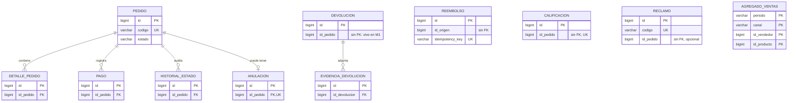

# Base de datos - Módulo D Ventas y Postventa

Proyecto en Supabase: `nsfrwxrjidyckgfriyhv` (PostgreSQL 17).

## 1. Qué se hizo

Se pasó el diagrama ER del módulo (`Diagrama_ER - VentasPostventas.drawio`) a una base de datos en Supabase. Quedaron 11 tablas repartidas en dos esquemas, uno por microservicio:

- `ventas` para M1
- `postventa` para M2

Las tablas de un esquema no tienen claves foráneas hacia el otro. Cuando M2 necesita un dato del pedido, guarda solo el `id_pedido` y lo consulta a M1 por la API. Así cada microservicio maneja sus propios datos, como se definió en la arquitectura.

## 2. Tablas

### Esquema `ventas` (M1)

| Tabla | Descripción | Funcionalidad |
|---|---|---|
| pedido | Datos generales del pedido: código, canal, estado, montos, contacto, envío y cupón | F1 |
| detalle_pedido | Productos del pedido con cantidad, precio e importe | F1 |
| pago | Pagos registrados para el pedido | F1 |
| historial_estado | Cambios de estado del pedido con actor, motivo y fecha | F1 |
| anulacion | Anulación del pedido, quién la pidió y quién la autorizó | F2 |

### Esquema `postventa` (M2)

| Tabla | Descripción | Funcionalidad |
|---|---|---|
| devolucion | Solicitudes de devolución o cambio y su resolución | F3 |
| evidencia_devolucion | Archivos que sustentan la devolución | F3 |
| reembolso | Devoluciones de dinero, con su origen y clave de idempotencia | F4 |
| calificacion | Puntaje (1 a 5) y comentario del cliente | F5 |
| reclamo | Libro de reclamaciones, con plazo de 15 días hábiles | F6 |
| agregado_ventas | Totales por periodo, canal, vendedor y producto para el dashboard | F6 |

### Relaciones

Dentro de `ventas`, la tabla `pedido` se relaciona con `detalle_pedido`, `pago` e `historial_estado` (uno a muchos) y con `anulacion` (uno a cero o uno). Dentro de `postventa`, `devolucion` se relaciona con `evidencia_devolucion` (uno a muchos).

`reclamo`, `reembolso`, `calificacion` y `agregado_ventas` no tienen relaciones físicas porque hacen referencia a datos de M1 o de otros módulos.



## 3. Cómo se hizo

1. Se tomaron las entidades y atributos del diagrama ER (11 entidades, 105 atributos).
2. Se escribió el script `ventas_postventa_schema.sql` con una tabla por entidad. Los nombres se pasaron a snake_case (`nombreContacto` → `nombre_contacto`), los `decimal` a `numeric(12,2)`, los `datetime` a `timestamptz` y los `id` a `bigint` autogenerado.
3. Los campos que el diagrama marca como "referencia API" o "referencia externa" se dejaron como columnas normales, sin clave foránea.
4. Se probó el script en un PostgreSQL local.
5. Se reactivó el proyecto de Supabase, que estaba pausado, y se aplicó el script como migración (`crear_esquemas_ventas_postventa`).
6. Se activó RLS en todas las tablas para que no se pueda acceder a ellas desde la API pública de Supabase. Solo el backend, conectado directamente a la base, podrá usarlas.
7. Se eliminaron tres tablas antiguas que estaban en el esquema `public`.

### Restricciones

Además de lo que muestra el diagrama, se agregaron estas validaciones a partir de los comentarios del ER y de las especificaciones:

- `pedido.estado` solo acepta CREADO, PAGADO, EN_PREPARACION, DESPACHADO, ENTREGADO y ANULADO (ESP-03).
- `historial_estado.actor` solo acepta CLIENTE, GESTOR, CANAL_CHATBOT, PASARELA_PAGOS y SISTEMA_LOGISTICA.
- Un pedido puede tener como máximo una anulación.
- `pedido.codigo` y `reclamo.codigo` no se pueden repetir.
- `reembolso.tipo_origen` solo acepta ANULACION o DEVOLUCION, y `reembolso.estado` solo PENDIENTE, EXITOSO o FALLIDO.
- `reembolso.idempotency_key` es única, para que un reintento no genere un segundo pago (ESP-09). Además, solo puede haber un reembolso por cada anulación o devolución.
- `calificacion.puntaje` va de 1 a 5 y hay una calificación por pedido (ESP-11).
- Las cantidades deben ser mayores a 0 y los montos no pueden ser negativos.

También se agregaron índices en `id_pedido` e `id_devolucion`.

## 4. Pruebas

En Supabase se registró un pedido de prueba (`PRUEBA-001`) con su detalle, pago e historial, y se consultó uniendo las cuatro tablas. Devolvió los datos correctos. Luego se eliminó el pedido y se borraron también sus registros relacionados (`on delete cascade`).

En la base local se probaron casos que deberían fallar, y todos fueron rechazados:

- pedido con un estado que no existe
- segunda anulación para el mismo pedido
- reembolso con una clave de idempotencia repetida
- calificación con puntaje 7
- detalle de un pedido inexistente

Por último, se comparó la base desplegada con el diagrama: coinciden las 11 tablas, las 105 columnas y las 5 relaciones.

Para repetir la prueba, en el SQL Editor de Supabase:

```sql
-- crear pedido de prueba
with p as (
  insert into ventas.pedido (codigo, canal, estado, subtotal, total, nombre_contacto)
  values ('PRUEBA-001', 'MARKETPLACE', 'PAGADO', 100, 100, 'Cliente de prueba')
  returning id
), d as (
  insert into ventas.detalle_pedido (id_pedido, sku, cantidad, precio_unitario, importe)
  select id, 'SKU-001', 2, 50, 100 from p
), pg as (
  insert into ventas.pago (id_pedido, metodo, monto, estado)
  select id, 'TARJETA', 100, 'CONFIRMADO' from p
)
insert into ventas.historial_estado (id_pedido, estado_anterior, estado_nuevo, actor)
select id, 'CREADO', 'PAGADO', 'PASARELA_PAGOS' from p;

-- consultar
select p.codigo, p.estado, d.sku, d.cantidad, pg.metodo, pg.monto,
       h.estado_anterior, h.estado_nuevo, h.actor
from ventas.pedido p
join ventas.detalle_pedido d   on d.id_pedido = p.id
join ventas.pago pg            on pg.id_pedido = p.id
join ventas.historial_estado h on h.id_pedido = p.id
where p.codigo = 'PRUEBA-001';

-- borrar
delete from ventas.pedido where codigo = 'PRUEBA-001';
```

## 5. Dónde verlo

- Tablas y datos: Table Editor, cambiando el esquema `public` por `ventas` o `postventa`.
- Diagrama: Database > Schema Visualizer.
- Consultas: SQL Editor.
- Migraciones: Database > Migrations.

Los demás esquemas que aparecen (auth, storage, realtime, vault, etc.) son de Supabase y no se deben modificar.

Para dar acceso a otro integrante: Settings de la organización > Team > Invite, con rol Developer. La invitación vence en 24 horas.

## 6. Conexión con el backend

La cadena de conexión se obtiene con el botón Connect y se guarda como variable de entorno en Render, no en el repositorio. Cada microservicio apunta a su esquema:

```properties
# M1 - servicio-pedidos
spring.datasource.url=${DB_URL}?currentSchema=ventas
spring.jpa.properties.hibernate.default_schema=ventas
spring.jpa.hibernate.ddl-auto=validate

# M2 - servicio-postventa
spring.datasource.url=${DB_URL}?currentSchema=postventa
spring.jpa.properties.hibernate.default_schema=postventa
spring.jpa.hibernate.ddl-auto=validate
```

Se usa `validate` porque las tablas ya existen. La conexión directa de Supabase usa IPv6; si da problemas, se puede usar la opción Session pooler.

## 7. Pendientes

Por definir en equipo:

- La anulación está en `ventas` (M1) según el ER, pero en el C4 nivel 2 aparece en M2. Hay que alinear ambos documentos.
- En el ER se dibuja la relación devolución-reembolso, pero `reembolso` usa `id_origen` y `tipo_origen`, que puede apuntar a una anulación (M1) o a una devolución (M2). Se dejó sin clave foránea.
- En la base el estado se guarda como `EN_PREPARACION`; el enum en Java debe usar el mismo valor.
- Faltan definir los valores válidos de `pago.estado`, `devolucion.estado`, `reclamo.estado` y `canal`.
- El esquema de M1 se llama "Ventas" en el ER y "Pedidos" en el C4.

Trabajo técnico:

- Crear un usuario de base de datos para cada microservicio, con permisos solo sobre su esquema. Por ahora ambos usarían el mismo.
- Crear el bucket de Storage para las evidencias de devolución.
- Conectar los microservicios de Spring Boot.

## 8. Archivos

- `Diagrama_ER - VentasPostventas.drawio`: diagrama original.
- `ventas_postventa_schema.sql`: script de creación de la base.
- `base-de-datos-ventas-postventa.md`: este documento.
